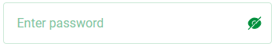
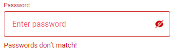

## Current Input State



```html
<div class="input-form icon-input">....</div>
```

## Invalid Input State



```html
<div class="input-form icon-input invalid">....</div>
```

## Nav default state


```html
<div class="menu__nav">.....</div>
```

## Nav active state


```html
<div class="menu__nav active">.....</div>
```

## Sub nav default state


```html
<div class="menu__subitems">....</div>
```

## Sub nav active state


```html
<div class="menu__subitems active">....</div>
```

## list nav active state


```html
<ul class="menu__subnav__items">
  <li class="active"><a href="">Project name</a></li>
</ul>
```

## Notifications active state


```html
<a href class="notification active">....</a>
```
